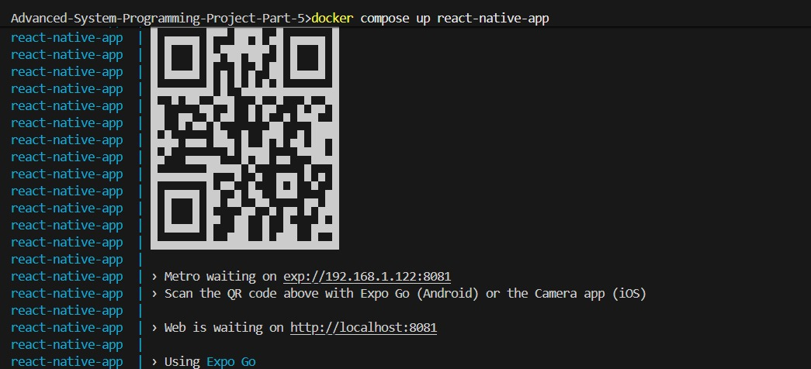

## How To Run The App

We use windows.
On the main folder (Advanced-System-Programming-Project), run:

```
$env:IP="<value>"
docker compose up react-native-app
```
building may take a minute.

if youre running on the emulator of android studio, use IP="10.0.2.2"
if youre running on a phone, set value to be your PC's LAN IPv4 adress.

if youre using linux, we dont even know how you managed to install android studio. gl!

