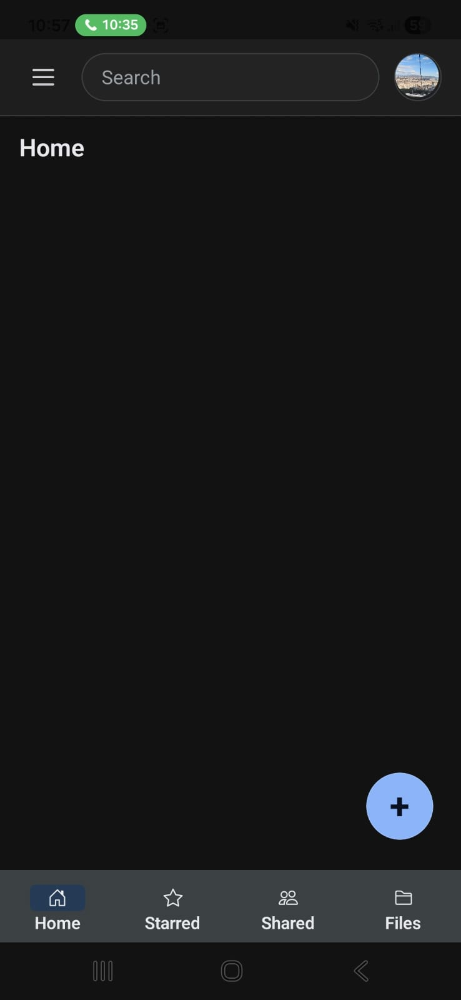
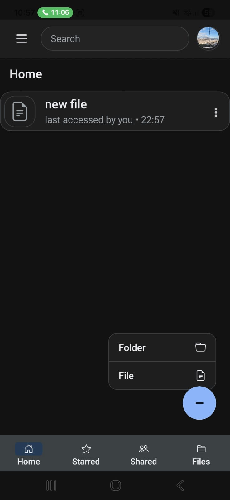
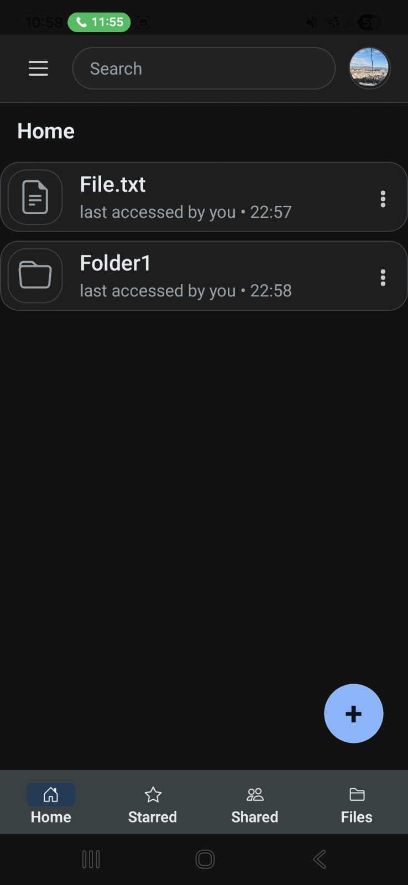
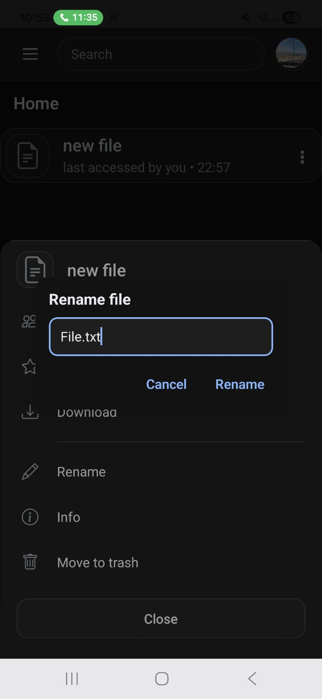
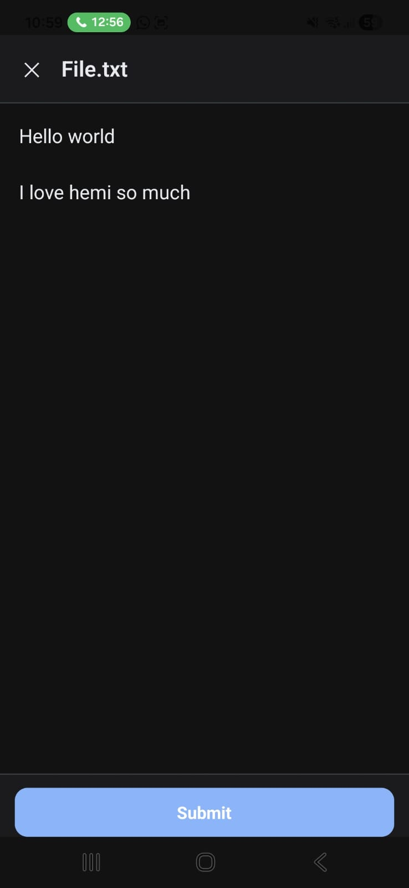
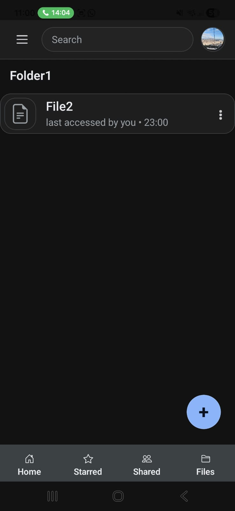
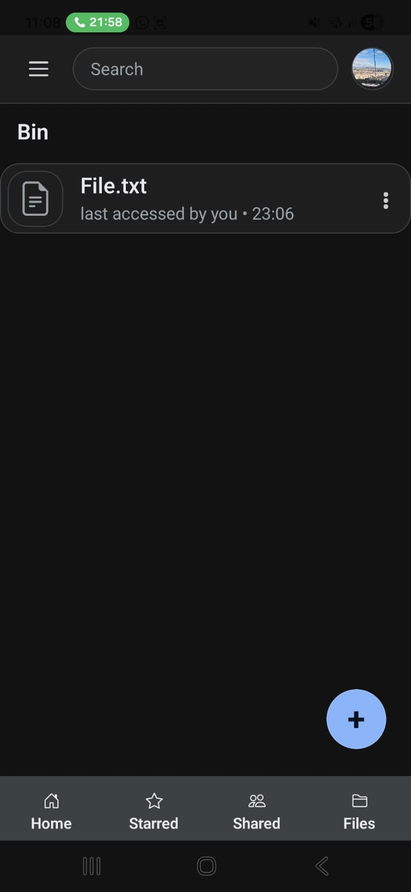
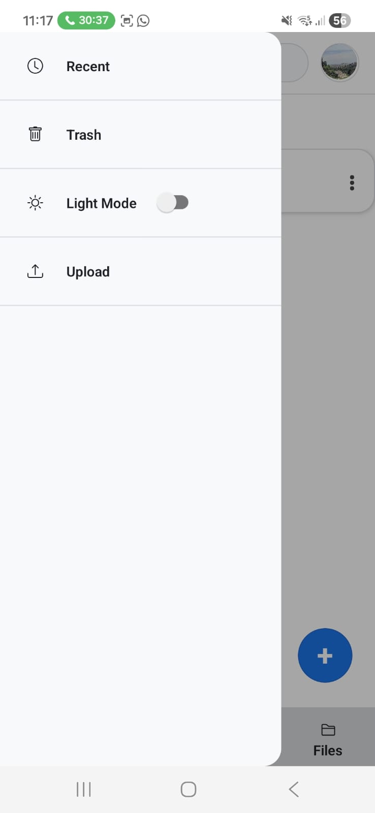
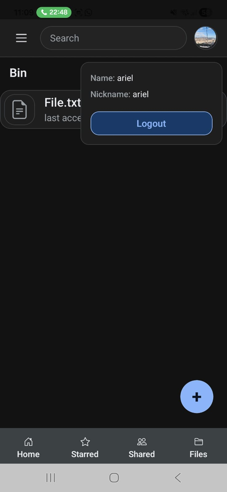

## Main Page
After logging in, the user is greeted with their drive. it shows them their file list, a top bar with a search feature, a hamburger button and their photo, add file & folder buttons and a navbar on the bottom.

## The Files List
once clicking on a file, the user is transfered to viewing the file. there they are met with (if they are allowed to) edit file & edit permissions features.
once clicking a folder, the list is updated to show the files and folders within the selected folder.
once clicking on the three dots of a given file/folder, additional functionality is shown to the user, like downloading the file, managing access, renaming it, starring it and more.

## The Side Bar
is reachable by pressing the hamburger menu.
the user is prompted with their drive, their starred items, their trash, files shared with them and recent items.
here the user may also create a new file or folder, which will be rooted in the current directory in the list.
here we also see the light/dark mode toggle.

## The Top Bar
the user has access to the search bar here. once used, all files/folders with matching names/content will appear. here the users' photo is shown on the right, and the hamburger bar on the left.

## The Navbar
a simple navbar for switching between your home, starred and shared files.

## Log Out
click on the profile photo and a log out button will appear.

## examples

main page on first login:

create a file:

or a folder:

rename a file via triple-dots:

or edit it by clicking the file:

you can create files/folders within folders:

delete files from the triple-dots (trash is shown, accessible via hamburger):

side bar:

log out:

