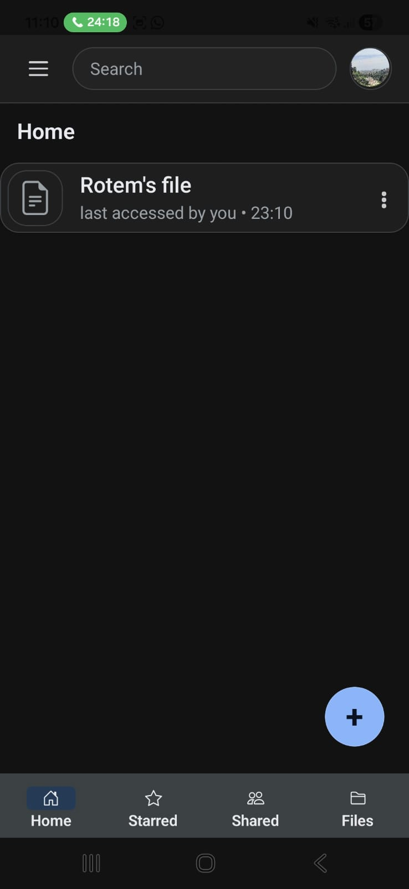
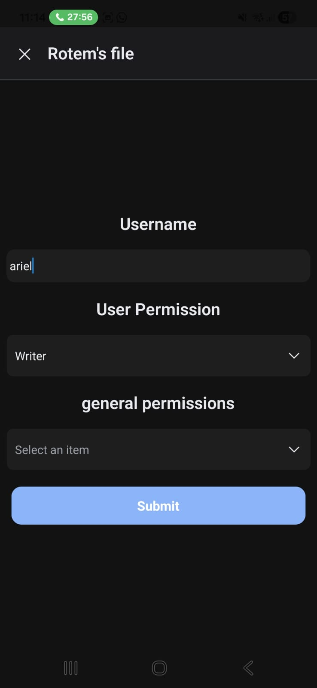
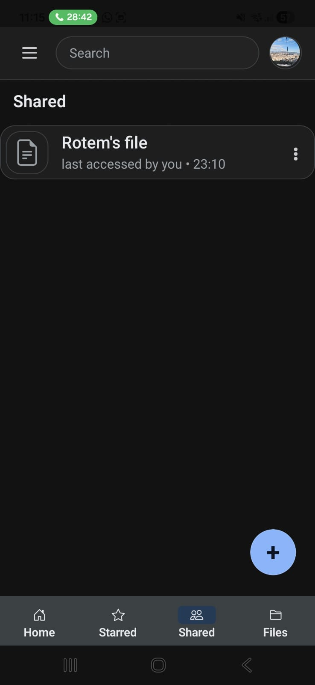
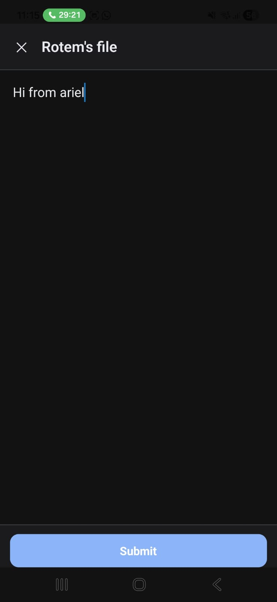
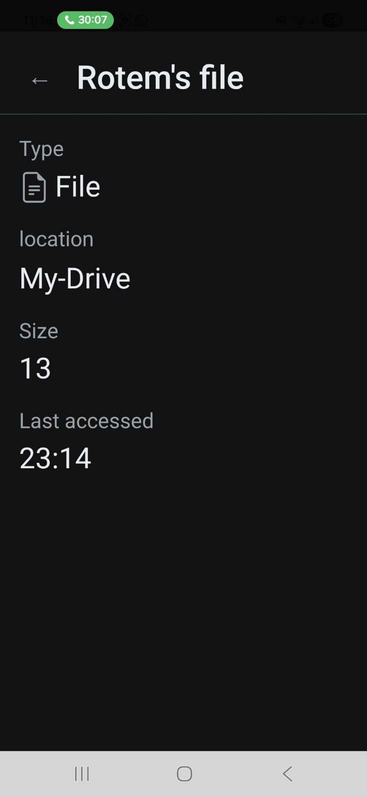

## Multiple users
say we have two users. they can share files between them.
rotem may create a file:

and give ariel access to it:

and now ariel can see and edit the file:

and have it change on rotem's drive (it's size has changed and its on rotems drive, cant really show content + current user):

